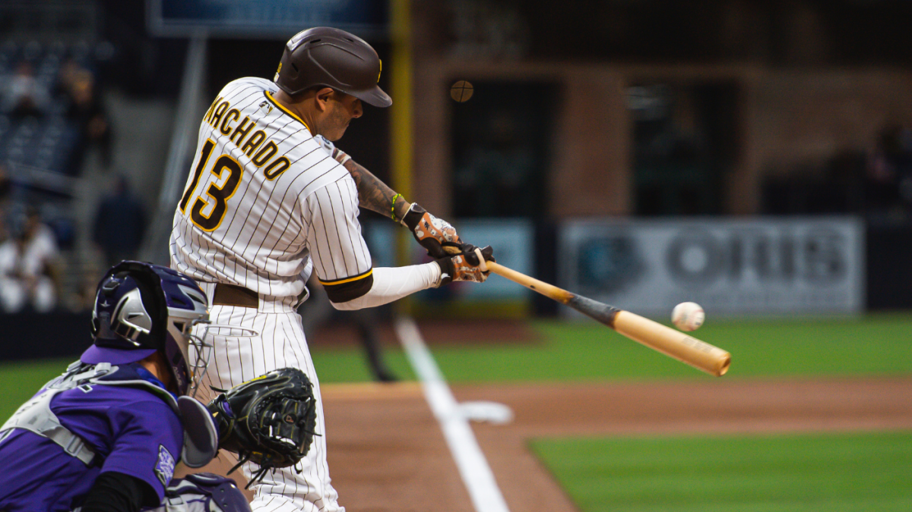

# Hitters

In this project, various methods were used to minimize the RMSE value and to determine the best algorithm for the algorithms we used on the Hitters data set.

---
## Machine learning algorithms used in the project
* Support Vector Regression (SVR) 
* XGBoost
* K-Nearest Neighbor (KNN)
* Classification And Regression Trees (CART)
* RandomForests
* GradientBoosting

---
* [Click to access project codes.](https://github.com/TarikKaanKoc/Hitters/blob/main/project.ipynb)
